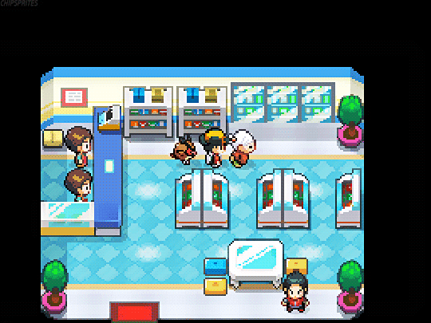

# Pokémart
<p align="center">
    
</p>
<p align="center">
    <b>Vente de maaaaagnifiques peluches pokémon</b>
</p>
<p align="center">
    <b>Auteurs : ChatGPT, Winninger Thomas</b>
</p>
<p align="center">
    <a target="_blank" href="https://www.pokemoncenter.com/category/plush"></a>
    <a target="_blank" href="https://github.com/Sckathach"></a>
</p>

## Routes
- `/` : Page d'accueil gérée par `IndexController`. Le template est `index.html.twig`.
- `/plush/list` : Liste de toutes les peluches. Le template est `plush_list.html.twig`.
- `/plush/{id}` : Page d'achat de la peluche selectionnée, les identifiants `{id}` commencent à 1. Le template est
`plush_show.html.twig`.
- Toutes les pages étendent la base `base.html.twig`.

## Installation
- Télécharger le projet sur Moodle ou sur ma [page GitHub](https://github.com/Sckathach/pokemart).
- `rm -fr composer.lock symfony.lock vendor/ var/cache/` : Pour supprimer le cache.
- `symfony composer install` : Installer toutes les dépendances.
> Si la console demande : ``` 
Do you want to include Docker configuration from recipes?
    [y] Yes
    [n] No
    [p] Yes permanently, never ask again for this project
    [x] No permanently, never ask again for this project
    (defaults to y):
``` appuyez sur `entrer` ou `y`.
- `symfony server:start` : Lancer le serveur.

## Entités
### Peluches (Plushies)
L'objet de base est la peluche. Chaque peluche appartient à une génération (inventaire). Chaque génération comporte
plusieurs peluches. Une peluche ne peut appartenir à plusieurs génération (je prends la prémière génération où le
pokémon apparaît).

| id | name     | price | height | generation | note |
|----|----------|-------|--------|------------|------|
| 1  | Jirachi  | 10.99 | 6.5    | gen3       | 5    |
| 2  | Évoli    | 16.99 | 6.5    | gen2       | 5    |
| 3  | Dracofeu | 16.99 | 7      | gen2       | 5    |
| 4  | Noctali  | 19.99 | 13     | gen2       | 5    |

### À faire
#### Générations (Generations)
| id | name        | tag  | description |
|----|-------------|------|-------------|
| 1  | Generation1 | gen1 | ...         | 
| 2  | Generation2 | gen2 | ...         |
| 3  | Generation3 | gen3 | ...         |
| 4  | Generation4 | gen4 | ...         | 

#### Cartes (Cards)
| id | name      | type     | hp |
|----|-----------|----------|----| 
| 1  | Pikachu   | electric | 90 |
| 2  | Pichu     | electric | 50 |
| 3  | Bulbasaur | grass    | 70 |

#### Collections 
| id | name | description                 | 
|----|------|-----------------------------|
| 1  | Cah  | La collection des champions |
| 2  | Tah  | La collection des trainers  |

## Copyrights
[Free CSS templates](https://www.free-css.com/)

> Oui, je n'ai pas écrit les 7438957839 lignes de code CSS tout seul -_-
